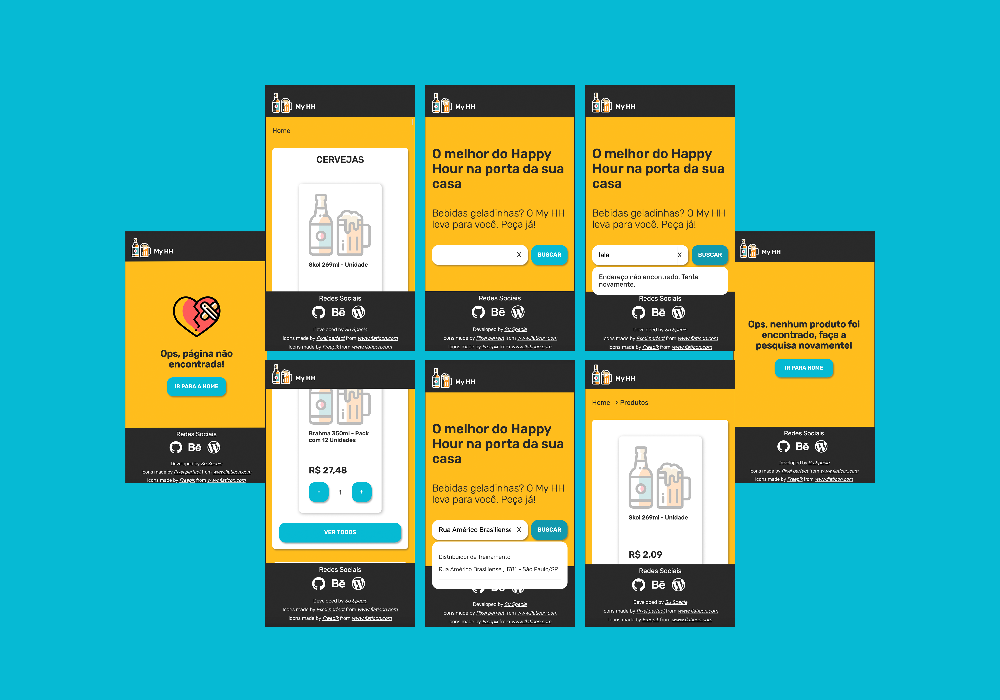
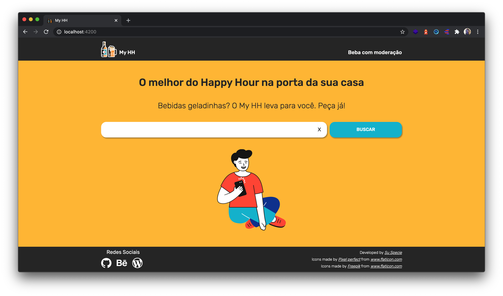
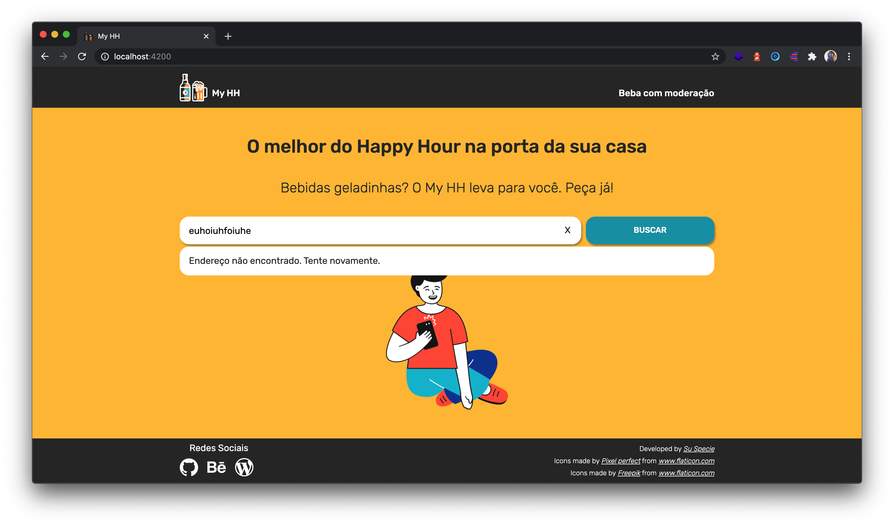
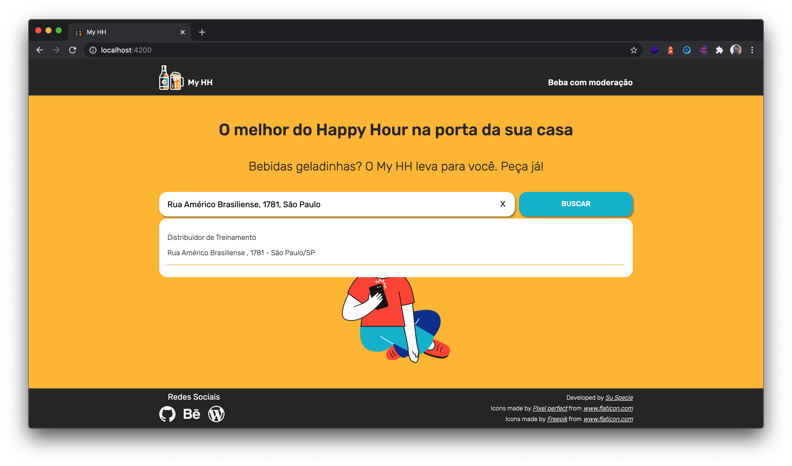
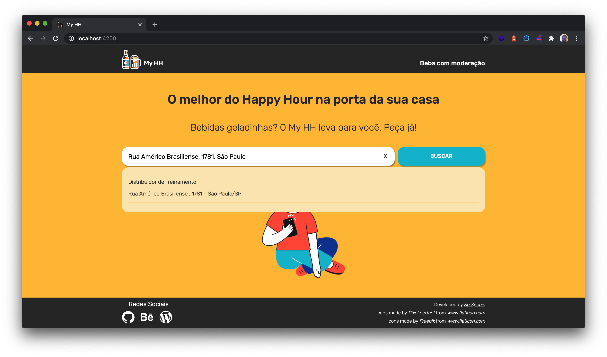
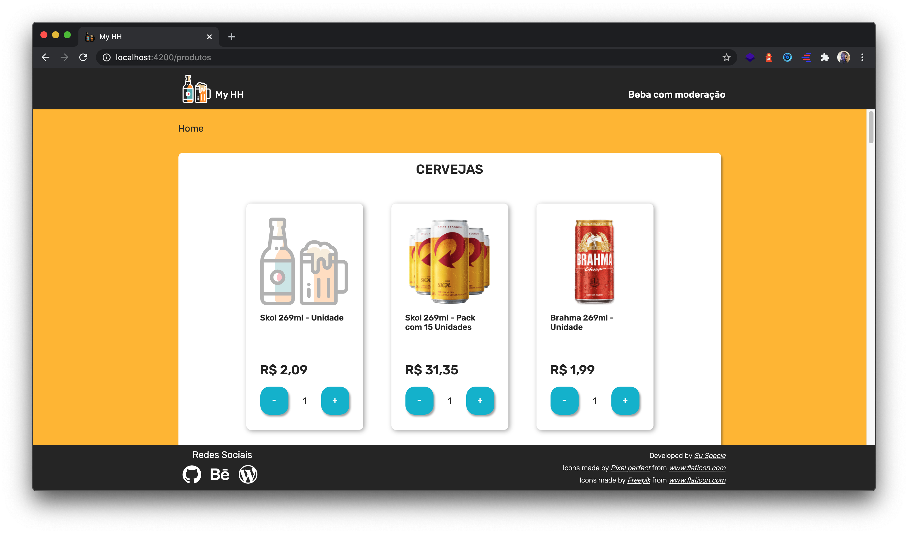
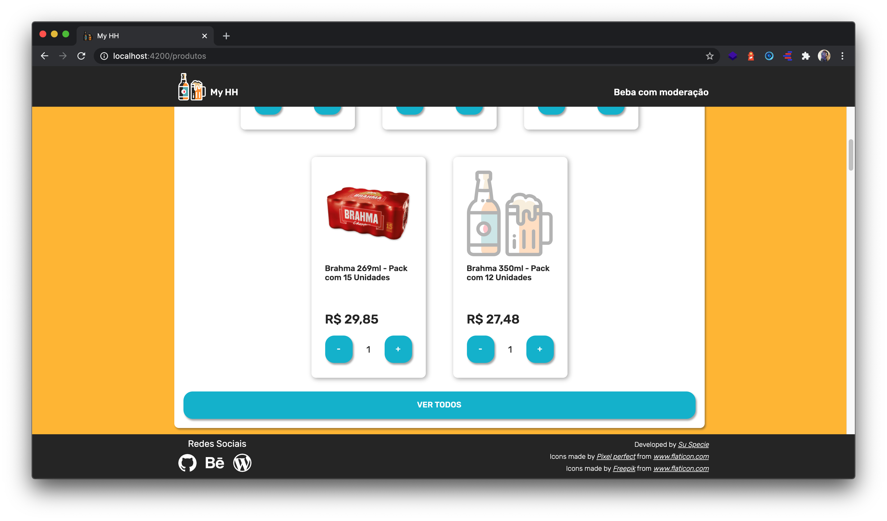
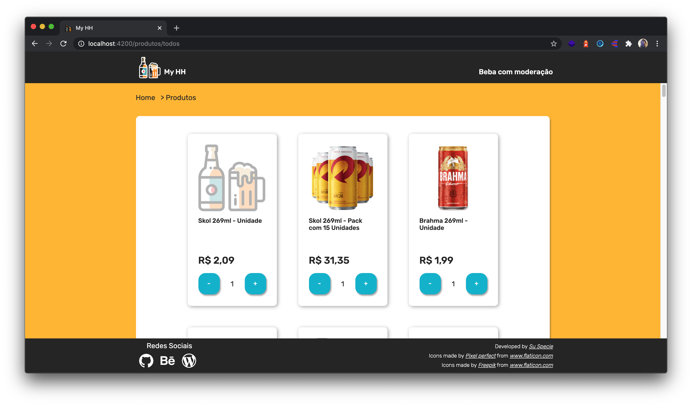
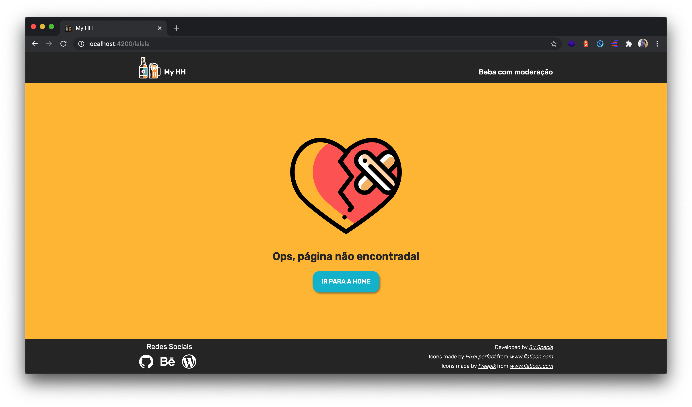
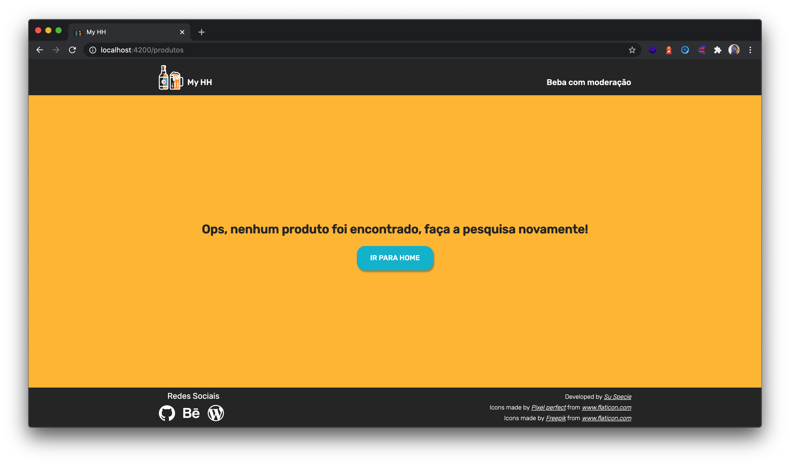

# My HH Project

O My HH é um projeto desenvolvido como resultado do desafio Frontend do [Zé Delivery](https://github.com/ZXVentures/ze-code-challenges/blob/master/frontend-mobile.**md**).

Este projeto simula um delivery de itens de Happy Hour.
Por meio de uma busca de endereço, o cliente terá acesso a uma lista de itens separadas por categorias, ou uma listagem de todos os produtos. Na lista de produtos, o cliente poderá aumentar ou diminuir a quantidade dos itens e visualizar os itens com preço atualizado.

# Por onde começar

## Pré-requisitos

- [Node](https://nodejs.org/en/)
- [NPM](https://www.npmjs.com/)
- [Angular Versão 10](https://cli.angular.io/)
- [Git](https://git-scm.com/)

> Lembrando que ao realizar a instalação do Node, o npm já é automaticamente instalado.

## Instalação

  - Faça o clone do projeto `git clone https://github.com/suspecie/my-hh-project.git`
  - Acrescente a key da api ["Maps JavaScript API" do Google Maps](https://cloud.google.com/maps-platform?hl=pt-br) na variável `API_KEY_GOOGLE_MAPS` no arquivo: `src/environments/app-settings.ts`
  - Na pasta do projeto, execute o comando `npm install`

## Execução

  - Na pasta do projeto, execute o comando `npm start`
  - Para visualizar o projeto, acesse `http://localhost:4200/`
  - Para visualizar os itens, utilizar o seguinte endereço: `Rua Américo Brasiliense, 1781, São Paulo`

### Lista de comandos

  - `npm start` - para iniciar o projeto.
  - `npm test` - para rodar os testes unitários.
  - `npm run test:coverage` - para verificar o relatório de cobertura de testes unitários.
  - `npm run build` - para gerar o build do projeto.
  

# Tecnologias Utilizadas
* Angular (última versão estável)
* [Angular CLI](https://cli.angular.io/) utilizado como boas práticas para criação de projetos Angular. Por isso utilizei mesmo pedindo para evitar.
* [JEST](https://jestjs.io) para testes unitários e cobertura de testes
* [SCSS](https://sass-lang.com/) para extensão de CSS
* [BEM Css](http://getbem.com) para componentes reutilizáveis
* [Git](https://git-scm.com/book/pt-br/v1/Primeiros-passos) repositório código-fonte
* [Git Flow](https://www.atlassian.com/br/git/tutorials/comparing-workflows/gitflow-workflow) para padronização de versionamento
* [Apollo](https://www.apollographql.com/docs/angular/) como client GraphQL
* [RxJs](https://angular.io/guide/rx-library) biblioteca de programação reativa
* [Maps JavaScript API](https://cloud.google.com/maps-platform?hl=pt-br) api do Google Maps para busca de endereços.

# Resultado Final

